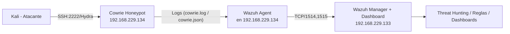

# Mini‑SOC: Wazuh + Cowrie Honeypot (Lab)


Proyecto de laboratorio para aprender y demostrar habilidades de **detección**, **recolección de logs** y **análisis** en un mini‑SOC casero usando **Wazuh SIEM** y el **honeypot Cowrie**. Incluye guía para reproducir el entorno, reglas personalizadas de Wazuh y ejemplos de ataques.

> Estado del autor: Funcionando con Wazuh Manager en `192.168.229.133` y honeypot Cowrie + wazuh‑agent en `192.168.229.134` (puerto SSH simulado `2222`).

---

## 🎯 Objetivos de aprendizaje
- Integrar fuentes de logs (honeypot → SIEM) y validar el pipeline end‑to‑end.
- Detectar y clasificar ataques de **fuerza bruta SSH** con reglas personalizadas.
- Crear filtros y paneles en Wazuh/Elastic para **Threat Hunting**.
- Documentar y presentar el proyecto como experiencia práctica.

---

## 🏗️ Arquitectura (Mermaid)

---

## Versiones utilizadas

| Componente         | Versión / Build      | Notas                                   |
|--------------------|----------------------|-----------------------------------------|
| **Wazuh Manager**  | 4.8.2-1              | Instalado en Ubuntu Server 22.04 LTS    |
| **Wazuh Agent**    | 4.8.2-1              | Instalado en Cowrie VM                  |
| **Cowrie Honeypot**| 2.5.0 (GitHub HEAD)  | Instalado en Debian 11                  |
| **Sistema Operativo Manager** | Ubuntu Server 22.04 LTS | VM en VMware Workstation             |
| **Sistema Operativo Honeypot**| Debian 11 Bullseye      | VM en VMware Workstation                |
| **Herramienta de ataque** | Hydra 9.4           | Usado para pruebas de fuerza bruta SSH  |

> ⚠️ Nota: estas versiones fueron las probadas en el laboratorio.  
> Otras versiones más recientes pueden requerir ajustes menores en configuración o dependencias.
Para detalles de instalación exacta → [docs/versions.md](docs/versions.md)

---

## 📦 Requisitos
- 1 VM con **Wazuh Manager** (ej.: `192.168.229.133`)
- 1 VM **honeypot** con **Cowrie** y **wazuh‑agent** (ej.: `192.168.229.134`)
- 1 VM **Kali** para pruebas de ataque
- Red interna que permita comunicación entre VMs

⚙️ Variables de entorno  
Este proyecto utiliza un archivo `.env` para configurar IPs, puertos y credenciales de ejemplo.  

1. Copiar el archivo `.env.example` a `.env`  
2. Ajusta los valores según tu entorno  


---

## ⚙️ Pasos de instalación (resumen)
### 1) Cowrie (en el honeypot)
- Instalar Cowrie (guía oficial) y dejarlo escuchando **SSH en `2222`** (por defecto de Cowrie).
- Validar que el servicio arranca y genera claves (RSA/ECDSA/ED25519).

## Instalación rápida

1. Clona este repo
2. Copia `.env.example` a `.env` y ajusta valores
3. Ejecuta:
   ```bash
   sudo ./scripts/setup_manager.sh
   sudo ./scripts/setup_honeypot.sh


### 2) Wazuh Agent (en el honeypot)
Instalar la versión que coincida con tu Manager (ej.: 4.8.2‑1) y configurar el **servidor**:
```xml
<!-- /var/ossec/etc/ossec.conf (sección <client>) -->
<client>
  <server>
    <address>192.168.229.133</address>
    <port>1514</port>
    <protocol>tcp</protocol>
  </server>
</client>
```

Añadir la recolección de logs de Cowrie:
```xml
<!-- /var/ossec/etc/ossec.conf (dentro de <ossec_config>) -->
<localfile>
  <log_format>json</log_format>
  <location>/var/log/cowrie/cowrie.json</location>
</localfile>
<localfile>
  <log_format>syslog</log_format>
  <location>/var/log/cowrie/cowrie.log</location>
</localfile>
```

Registrar el agente contra el Manager:
```bash
sudo /var/ossec/bin/agent-auth -m 192.168.229.133 -p 1515
sudo systemctl enable --now wazuh-agent
```

### 3) Validación rápida
- Desde **Kali**:
  ```bash
  ssh -p 2222 root@192.168.229.134
  # mete cualquier password falsa
  ```
- En **Wazuh Dashboard** (Manager): ir a **Threat Hunting** y filtrar por `agent.name: "honeypot"`.

---

## 🐍 Ataque de ejemplo con Hydra
Ejemplo básico (diccionarios pequeños):
```bash
echo "root" > users.txt
echo -e "1234\npassword\nadmin\nroot" > passwords.txt
hydra -L users.txt -P passwords.txt -s 2222 192.168.229.134 ssh
```

Ejemplo con diccionario grande `rockyou.txt` (en Kali):
```bash
sudo bash -lc 'test -f /usr/share/wordlists/rockyou.txt || gunzip -k /usr/share/wordlists/rockyou.txt.gz'
hydra -l root -P /usr/share/wordlists/rockyou.txt -s 2222 192.168.229.134 ssh
```

---

## 🔔 Reglas personalizadas en Wazuh
Archivo de ejemplo: [`config/local_rules.xml`](config/local_rules.xml)

```xml
<group name="cowrie,">
  <rule id="100200" level="12">
    <decoded_as>json</decoded_as>
    <field name="eventid">cowrie.login.failed</field>
    <description>Honeypot brute-force attempt detected (SSH)</description>
    <mitre>
      <id>T1110</id>
      <tactic>credential-access</tactic>
      <technique>Brute Force</technique>
    </mitre>
  </rule>

  <rule id="100201" level="15">
    <decoded_as>json</decoded_as>
    <field name="eventid">cowrie.login.success</field>
    <description>Honeypot login success (possible compromise)</description>
    <mitre>
      <id>T1078</id>
      <tactic>defense-evasion</tactic>
      <technique>Valid Accounts</technique>
    </mitre>
  </rule>
</group>
```

> Copiar este archivo a `/var/ossec/etc/rules/local_rules.xml` en el **Manager** y reinicia:
> ```bash
> sudo systemctl restart wazuh-manager
> ```

---

## 🔎 Búsquedas útiles en el Dashboard (Threat Hunting)
- Solo eventos del honeypot:
  ```
  agent.name: "honeypot"
  ```
- Intentos fallidos de login en Cowrie:
  ```
  data.eventid: "cowrie.login.failed"
  ```
- Comandos ejecutados dentro de la sesión:
  ```
  data.eventid: "cowrie.command.input"
  ```

Más ejemplos en [`docs/dashboards.md`](docs/dashboards.md).

---

## 🧪 Muestras
- [`samples/hydra_command.md`](samples/hydra_command.md)
- [`samples/cowrie.login.failed.json`](samples/cowrie.login.failed.json)

---

## 🧰 Estructura del repo
```
mini-soc-wazuh-cowrie/
├── README.md
├── config/
│   ├── local_rules.xml
│   └── ossec.cowrie.sample.xml
├── docs/
│   ├── architecture.mmd
│   └── dashboards.md
├── samples/
│   ├── hydra_command.txt
│   └── cowrie.login.failed.json

```

---

## 🛡️ Notas de seguridad/ética
- **No exponer** el honeypot a Internet sin endurecimiento/aislamiento.
- **No subas** claves privadas, contraseñas o IPs públicas reales.
- Usa este repositorio con fines **educativos** y de **portfolio**.

---

## 📄 Licencia
Este proyecto está bajo la licencia MIT (ver `LICENSE`).

---

## 🙋‍♂️ Autor
Michael Jurado – 2025  
Contacto/LinkedIn/GitHub: *(https://www.linkedin.com/in/mikjurado/)*
