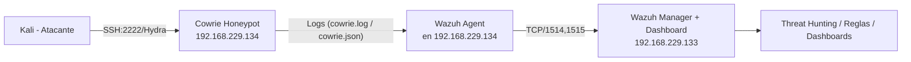

# Mini‑SOC: Wazuh + Cowrie Honeypot (Lab)

Proyecto de laboratorio para aprender y demostrar habilidades de **detección**, **recolección de logs** y **análisis** en un mini‑SOC casero usando **Wazuh SIEM** y el **honeypot Cowrie**. Incluye guía para reproducir el entorno, reglas personalizadas de Wazuh y ejemplos de ataques.

> Estado del autor: Funcionando con Wazuh Manager en `192.168.229.133` y honeypot Cowrie + wazuh‑agent en `192.168.229.134` (puerto SSH simulado `2222`).

---

## 🎯 Objetivos de aprendizaje
- Integrar fuentes de logs (honeypot → SIEM) y validar el pipeline end‑to‑end.
- Detectar y clasificar ataques de **fuerza bruta SSH** con reglas personalizadas.
- Crear filtros y paneles en Wazuh/Elastic para **Threat Hunting**.
- Documentar y presentar el proyecto como experiencia práctica.

---

## 🏗️ Arquitectura (Mermaid)

---

## 📦 Requisitos
- 1 VM con **Wazuh Manager** (ej.: `192.168.229.133`)
- 1 VM **honeypot** con **Cowrie** y **wazuh‑agent** (ej.: `192.168.229.134`)
- 1 VM **Kali** para pruebas de ataque
- Red interna que permita comunicación entre VMs

---

## ⚙️ Pasos de instalación (resumen)
### 1) Cowrie (en el honeypot)
- Instalar Cowrie (guía oficial) y dejarlo escuchando **SSH en `2222`** (por defecto de Cowrie).
- Validar que el servicio arranca y genera claves (RSA/ECDSA/ED25519).

### 2) Wazuh Agent (en el honeypot)
Instalar la versión que coincida con tu Manager (ej.: 4.8.2‑1) y configurar el **servidor**:
```xml
<!-- /var/ossec/etc/ossec.conf (sección <client>) -->
<client>
  <server>
    <address>192.168.229.133</address>
    <port>1514</port>
    <protocol>tcp</protocol>
  </server>
</client>
```
