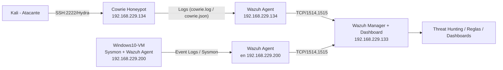

```mermaid
flowchart LR
  A[Kali - Atacante] -- SSH:2222/Hydra --> B[Cowrie Honeypot<br/>192.168.229.134]
  B -- Logs (cowrie.log / cowrie.json) --> C[Wazuh Agent<br/>192.168.229.134]
  
  F[Windows10-VM<br/>Sysmon + Wazuh Agent<br/>192.168.229.200] -- Event Logs / Sysmon --> G[Wazuh Agent<br/>en 192.168.229.200]
  
  C -- TCP/1514,1515 --> D[Wazuh Manager + Dashboard<br/>192.168.229.133]
  G -- TCP/1514,1515 --> D
  
  D --> E[Threat Hunting / Reglas / Dashboards]
```
