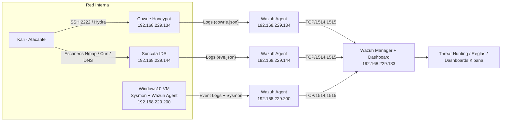

## 🏗️ Arquitectura v2 (Mermaid)

La arquitectura del laboratorio ahora incluye un IDS de red (Suricata) que complementa el análisis de ataques.

Kali Linux: VM atacante, genera tráfico malicioso controlado (Nmap, Hydra, curl, dig).

Suricata IDS (192.168.229.144): inspecciona tráfico de red en tiempo real y genera alertas (eve.json).

Cowrie Honeypot (192.168.229.134): simula un servicio SSH vulnerable, registra intentos de intrusión.

Windows 10 con Sysmon (192.168.229.200): endpoint monitorizado con telemetría avanzada (procesos, conexiones, autenticaciones).

Wazuh Agents: recolectan logs de cada máquina (Cowrie, Suricata, Windows).

Wazuh Manager + Kibana (192.168.229.133): centraliza alertas, aplica reglas de correlación y visualiza dashboards.

➡️ El flujo de datos va de fuentes de logs → agentes → manager → dashboards, simulando un SOC real.
