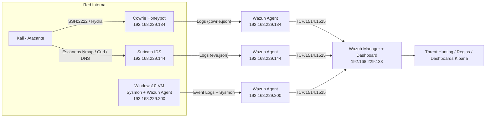

## 🏗️ Arquitectura v2 (Mermaid)


La arquitectura del laboratorio ahora incluye un IDS de red (Suricata) que complementa el análisis de ataques.

Kali Linux: VM atacante, genera tráfico malicioso controlado (Nmap, Hydra, curl, dig).

Suricata IDS (192.168.229.144): inspecciona tráfico de red en tiempo real y genera alertas (eve.json).

Cowrie Honeypot (192.168.229.134): simula un servicio SSH vulnerable, registra intentos de intrusión.

Windows 10 con Sysmon (192.168.229.200): endpoint monitorizado con telemetría avanzada (procesos, conexiones, autenticaciones).

Wazuh Agents: recolectan logs de cada máquina (Cowrie, Suricata, Windows).

Wazuh Manager + Kibana (192.168.229.133): centraliza alertas, aplica reglas de correlación y visualiza dashboards.

➡️ El flujo de datos va de fuentes de logs → agentes → manager → dashboards, simulando un SOC real.

📌 Explicación de cada VM

🔹 Kali Linux – Atacante

Rol: Máquina ofensiva usada para simular ataques reales.

Herramientas utilizadas:

`nmap` → escaneos de red (SYN, versión, scripts NSE).

`curl` → tráfico HTTP con user-agents sospechosos (ej. sqlmap, Nmap NSE).

`hydra` → ataques de fuerza bruta contra servicios SSH expuestos (Cowrie).

`dig` → consultas DNS para simular tunneling o resoluciones sospechosas.

Objetivo: Generar tráfico malicioso controlado que dispare alertas en Suricata y Wazuh.

🔹 Suricata – IDS de Red

Rol: Sistema de Detección de Intrusos (IDS) desplegado en una VM Linux.

Logs: `/var/log/suricata/eve.json` recolectados por Wazuh Agent.

Qué detecta:

Escaneos Nmap.

User-agents sospechosos (`sqlmap`, `Nmap NSE`).

Posibles DNS tunneling.

C2 / tráfico malicioso basado en reglas Emerging Threats (ET).

Objetivo: Inspeccionar tráfico de red y generar alertas para análisis en el SIEM.

🔹 Cowrie – Honeypot SSH

Rol: Honeypot de alta interacción simulando un servidor SSH vulnerable.

Logs: `cowrie.log` y `cowrie.json` enviados al Wazuh Agent.

Qué detecta:

Intentos de fuerza bruta con Hydra.

Sesiones de login exitosas/fallidas.

Comandos ejecutados por atacantes dentro del honeypot.

Objetivo: Capturar comportamientos de intrusión SSH y enriquecer la visibilidad del SOC.

🔹 Windows 10 con Sysmon – Endpoint Monitorizado

Rol: Simulación de un endpoint corporativo monitorizado con Sysmon + Wazuh Agent.

Logs enviados:

EventID 1 → creación de procesos (`powershell.exe`, `cmd.exe`).

EventID 3 → conexiones de red salientes.

EventID 4625 → intentos fallidos de login.

EventID 4720 → creación de cuentas locales.

Objetivo: Detección de actividad sospechosa a nivel host (procesos, usuarios, accesos).

🔹 Wazuh Manager + Kibana – SIEM Central

Rol: Consolida y correlaciona los logs de todas las fuentes (Cowrie, Suricata, Sysmon).

Servicios:

Wazuh Manager → ingesta y análisis de logs, correlación de reglas.

Kibana/Wazuh Dashboard → visualización de alertas y dashboards personalizados.

Ejemplos de detección:

Rootcheck detectando binarios trojanizados (`/bin/passwd`).

Alertas IDS de Suricata (`ET INFO Possible Kali Linux hostname`).

Fuerza bruta SSH desde Kali → Cowrie.

Actividad sospechosa en Windows (Sysmon).

Objetivo: Actuar como el núcleo del Mini-SOC, simulando la operación de un SOC real.


### 📊 Flujo de logs y alertas – Resumen rápido

| Fuente | ¿Qué se recolecta? | ¿Desde dónde? | ¿Cómo viaja al Manager? | Llega como… | Ejemplo de alerta |
|--------|--------------------|---------------|--------------------------|--------------|-------------------|
| **Kali → (tráfico hacia Suricata)** | `eve.json` (`event_type=alert`, dns, http, flow) | `/var/log/suricata/eve.json` (VM Suricata) | **Wazuh Agent** (TCP **1514/1515**) → Manager | `alerts.json` (decoder `json`, group `suricata`) | `ET INFO Possible Kali Linux hostname in DHCP Request Packet` |
| **Kali → Cowrie** | `cowrie.json` / `cowrie.log` | `/var/log/cowrie/` (VM Cowrie) | **Wazuh Agent** → Manager | `alerts.json` (decoder `cowrie`) | `cowrie.login.success`, `cowrie.command.input` |
| **Windows 10 (Sysmon + Security)** | Eventos Windows + Sysmon | Canal Windows + Sysmon (agente Wazuh Win) | **Wazuh Agent** → Manager | `alerts.json` (decoders `windows`, `sysmon`) | `EventID 1 ProcessCreate`, `4625 Failed logon` |
| **Linux host (rootcheck/FIM)** | Integridad / Rootcheck | `rootcheck`, `/var/ossec/` | **Wazuh Agent** → Manager | `alerts.json` (decoder `rootcheck`) | `Trojaned version of file '/bin/passwd' detected` |

\* Todos los agentes envían por TCP 1514 (logs) y 1515 (gestión/clave) hacia el Wazuh Manager.

###Diagrama (Mermaid)
```mermaid
flowchart LR
  A[Kali] -->|Escaneos / HTTP / DNS| S[Suricata IDS]
  A -->|SSH Hydra| C[Cowrie Honeypot]
  W[Windows 10 + Sysmon] -->|Eventos| GA[Wazuh Agent Win]

  S -->|eve.json| AS[Wazuh Agent Suricata]
  C -->|cowrie.json| AC[Wazuh Agent Cowrie]

  subgraph Envío a Manager (1514/1515 TCP)
    AS --> M[Wazuh Manager]
    AC --> M
    GA --> M
  end

  M --> K[Kibana / Wazuh Dashboards]

```

Config clave por fuente (minimal)

Suricata (agente Linux)

```
<localfile>
  <log_format>json</log_format>
  <location>/var/log/suricata/eve.json</location>
</localfile>

```
Cowrie (agente Linux)

```
<localfile>
  <log_format>json</log_format>
  <location>/var/log/cowrie/cowrie.json</location>
</localfile>

```

Windows 10 (agente Win)

Activar Sysmon (config recomendada) y fuentes “Security”, “System”, “Application”.

El agente ya envía canales de eventos por defecto (ajustable en ossec.conf de Windows).

Verificación rápida (operativa)

En cada agente

```
# Suricata
sudo tail -f /var/ossec/logs/ossec.log | grep -E 'suricata|eve.json'

# Cowrie
sudo tail -f /var/ossec/logs/ossec.log | grep -i cowrie

# Windows (PowerShell)
Get-Content "C:\Program Files (x86)\ossec-agent\ossec.log" -Wait | Select-String Sysmon

```

En el Manager

```
# Ver agentes conectados
sudo /var/ossec/bin/agent_control -lc

# Ver alertas por fuente
sudo grep -i suricata /var/ossec/logs/alerts/alerts.json | tail
sudo grep -i cowrie   /var/ossec/logs/alerts/alerts.json | tail
sudo grep -i sysmon   /var/ossec/logs/alerts/alerts.json | tail
sudo grep -i rootcheck /var/ossec/logs/alerts/alerts.json | tail

```

Pruebas que disparan alertas (end-to-end)

Suricata (IDS):

```
nmap -sS -T4 -p1-1000 <IP_suricata>
curl -A "sqlmap" http://<IP_suricata>
dig test.malwaredomain.com @<IP_suricata>

```

→ Verás firmas ET `SCAN`, `ET INFO`, posibles DNS anómalos.

Cowrie (SSH):

```
hydra -l root -P /usr/share/wordlists/rockyou.txt ssh://<IP_cowrie>:2222
```

→ `cowrie.login.failed/success` y `cowrie.command.input`.

Windows (Sysmon):

Ejecutar `powershell.exe -enc ...` (genera EventID 1).

Intentos de inicio fallidos (genera 4625).

Rootcheck/FIM (Linux):

Simular cambio en binario de sistema (o dejar que el escaneo programado alerte).

Visto `Trojaned /bin/passwd` como evidencia.

Errores comunes (y solución)

Veo logs de `pam/sudo`, pero no de Suricata/Cowrie:

Falta `<localfile>` del archivo JSON → añádelo y `systemctl restart wazuh-agent`.

No aparecen alertas aunque hay tráfico:
Suricata sin reglas/actualización → `sudo suricata -T -c /etc/suricata/suricata.yaml` y actualizar ET rules.

Nada llega al Manager:
Puertos 1514/1515 bloqueados o agente desconectado → `agent_control -lc`.
